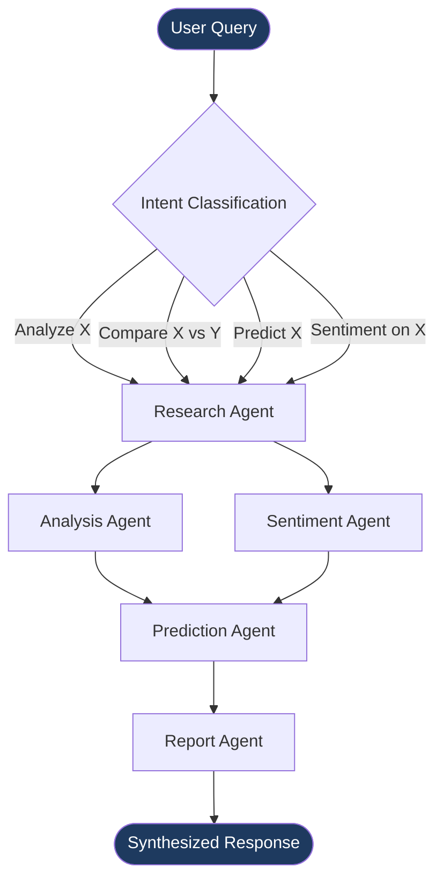
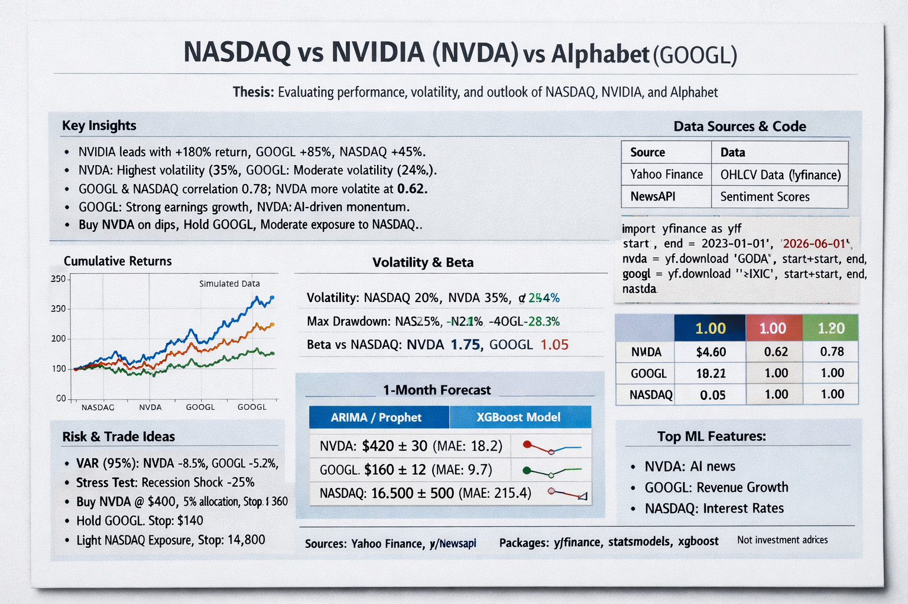
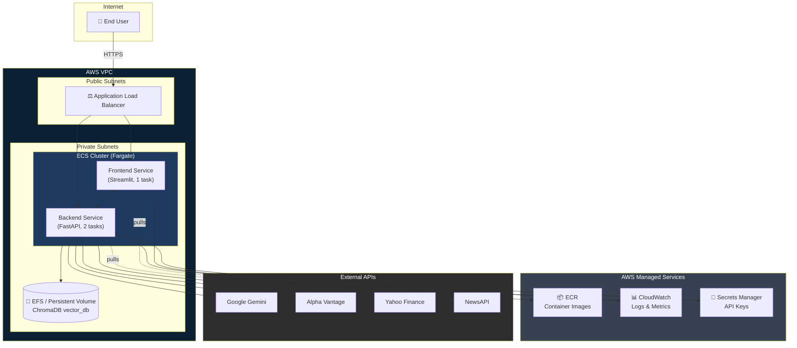

<div align="center">

#  MarketPilot

### *From Data to Confident Decision*

**An end-to-end agentic AI system for financial market intelligence — powered by Google Gemini, LangChain, RAG, and Google's Agentic Development Kit (ADK).**

[](https://www.python.org/)
[](https://fastapi.tiangolo.com/)
[](https://streamlit.io/)
[](https://python.langchain.com/)
[](https://ai.google.dev/)
[](https://www.trychroma.com/)
[](https://www.docker.com/)
[](https://aws.amazon.com/ecs/)
[](#-license)
[](#)

[🎥 Watch the Demo](#-demo-video) • [🏗 Architecture](#-architecture) • [⚙️ Quick Start](#%EF%B8%8F-quick-start) • [📡 API Reference](#-api-reference) • [☁️ AWS Deployment](#%EF%B8%8F-aws-deployment) • [👤 Author](#-author--contact)

</div>

---

## 📌 Table of Contents

- [Overview](#-overview)
- [Demo Video](#-demo-video)
- [Why MarketPilot?](#-why-marketpilot)
- [Architecture](#-architecture)
- [Multi-Agent System — Deep Dive](#-multi-agent-system--deep-dive)
- [Tech Stack](#-tech-stack)
- [Project Structure](#-project-structure)
- [Environment Variables Reference](#-environment-variables-reference)
- [Quick Start](#%EF%B8%8F-quick-start)
- [Configuration](#-configuration)
- [Usage Examples](#-usage-examples)
- [API Reference](#-api-reference)
- [RAG Pipeline — Deep Dive](#-rag-pipeline--deep-dive)
- [AWS Deployment](#%EF%B8%8F-aws-deployment)
- [Cost Estimates & Optimization](#-cost-estimates--optimization)
- [Monitoring & Observability](#-monitoring--observability)
- [Security Best Practices](#-security-best-practices)
- [Testing](#-testing)
- [Troubleshooting](#-troubleshooting)
- [Performance Optimization](#-performance-optimization)
- [Frequently Asked Questions](#-frequently-asked-questions)
- [Roadmap / Future Enhancements](#-roadmap--future-enhancements)
- [Contributing](#-contributing)
- [Author & Contact](#-author--contact)
- [License](#-license)

---

## 🧭 Overview

**MarketPilot** is a production-grade, multi-agent financial intelligence platform that transforms raw, noisy market data into clear, confident, and **explainable** investment insights.

Instead of relying on a single monolithic LLM call to "do everything," MarketPilot orchestrates a **team of specialized AI agents** — each responsible for a distinct stage of financial reasoning: data gathering, technical/fundamental analysis, sentiment evaluation, ML-based forecasting, and final report synthesis. These agents collaborate through an **Agent Orchestrator** built on **Google's Agentic Development Kit (ADK)**, grounded by a **Retrieval-Augmented Generation (RAG)** pipeline backed by **ChromaDB**, and powered by **Google Gemini** as the central reasoning engine.

The result is a conversational financial analyst that can answer questions like *"Analyze Tesla's performance and compare it with Ford"* with **transparent, source-grounded, multi-step reasoning** — not a black box that spits out a single confident-sounding paragraph.

> 💡 **Who is this for?** Retail investors, finance students, quant enthusiasts, and analysts who want institutional-grade research workflows — technical indicators, sentiment scoring, predictive modeling, and synthesized reports — through a single conversational interface, without needing a Bloomberg terminal.

### Design Principles

| Principle | What it means in MarketPilot |
|---|---|
| **Separation of Concerns** | Each agent owns one job and does it well — no "god prompt" trying to do everything |
| **Grounded Reasoning** | Every claim is traceable back to retrieved data via the RAG layer |
| **Composable Pipelines** | Agents can be re-ordered, swapped, or extended without rewriting the orchestrator |
| **API-First** | Every capability is exposed as a clean REST endpoint — the Streamlit UI is just one possible client |
| **Cloud-Portable** | Fully containerized; runs identically on a laptop or on AWS ECS Fargate |

---

## 🎥 Demo 

> 📺 **Live Demo / Walkthrough:** _[ADD YOUR DEMO VIDEO LINK HERE]_


> 📊 **Sample Report Output (PDF/Image):** _https://drive.google.com/file/d/1bKGOsfPe58rum_N8oDXtlMx0ZvHUjc40/view?usp=sharing_

---

## ✨ Why MarketPilot?

| Capability | Description |
|---|---|
| 🧠 **True Multi-Agent Reasoning** | Five purpose-built agents collaborate via an orchestrator instead of one prompt doing everything |
| 📚 **Grounded, Not Hallucinated** | RAG pipeline over ChromaDB retrieves real financial context before the LLM responds |
| 📈 **Quant + Qual Fusion** | Combines hard technical indicators (RSI, MACD, Bollinger Bands) with soft signals (news sentiment) |
| 🔮 **ML-Driven Forecasting** | Dedicated Prediction Agent generates short-horizon price trend forecasts |
| 💬 **Conversational UX** | Natural language chat interface — no need to know ticker syntax or finance jargon |
| 🔍 **Transparent Reasoning Traces** | Every agent's intermediate output is surfaced, so users see *how* a conclusion was reached |
| ☁️ **Cloud-Native by Design** | Dockerized microservices, deployable to AWS ECS Fargate via a single script |
| 🔌 **Developer-Friendly API** | Clean REST endpoints for analysis, prediction, comparison, and chat — fully documented via Swagger |
| 🧩 **Extensible by Design** | Add new agents, new data sources, or new indicators without touching the orchestration core |

---

## 🏗 Architecture

MarketPilot follows a **layered, service-oriented architecture** separating presentation, orchestration, intelligence, and data layers.

### High-Level System Architecture

```
┌─────────────────────────────────────────────────────────┐
│         🖥️  PRESENTATION LAYER                         │
│                                                         │
│        Streamlit Frontend                              │
│   (Chat • Dashboard • Interactive Charts)              │
└────────────────────┬────────────────────────────────────┘
                     │
┌────────────────────▼────────────────────────────────────┐
│         ⚙️  API & ORCHESTRATION LAYER                  │
│                                                         │
│  ┌─────────────────────────────────────────────────┐   │
│  │ FastAPI Routes (/chat, /analyze, /predict)     │   │
│  └──────────────┬──────────────────────────────────┘   │
│                 │                                       │
│  ┌──────────────▼──────────────────────────────────┐   │
│  │ Agent Orchestrator (Google ADK)                │   │
│  │ - Intent Classification                        │   │
│  │ - Agent Sequencing                             │   │
│  │ - Context Management                           │   │
│  └──────────────┬──────────────────────────────────┘   │
│                 │                                       │
│  ┌──────────────▼──────────────────────────────────┐   │
│  │ RAG Pipeline (ChromaDB Vector Store)           │   │
│  │ - Document Retrieval                           │   │
│  │ - Context Injection                            │   │
│  └──────────────┬──────────────────────────────────┘   │
└────────────────┼──────────────────────────────────────┘
                 │
┌────────────────▼──────────────────────────────────────┐
│        🤖  MULTI-AGENT INTELLIGENCE LAYER             │
│                                                       │
│  ┌─────────────┐  ┌─────────────┐  ┌────────────┐   │
│  │  Research   │  │  Analysis   │  │ Sentiment  │   │
│  │   Agent     │→ │   Agent     │→ │   Agent    │   │
│  │             │  │             │  │            │   │
│  │ Data        │  │ Technical & │  │ News       │   │
│  │ Gathering   │  │ Fundamental │  │ Sentiment  │   │
│  └─────────────┘  └─────────────┘  └────────────┘   │
│         │              │                  │           │
│         └──────────────┬──────────────────┘           │
│                        │                              │
│         ┌──────────────▼──────────────┐              │
│         │   Prediction Agent          │              │
│         │ (ML Forecast Model)         │              │
│         └──────────────┬───────────────┘             │
│                        │                              │
│         ┌──────────────▼──────────────┐              │
│         │    Report Agent             │              │
│         │ (Insight Synthesis)         │              │
│         └──────────────┬───────────────┘             │
└────────────────────────┼──────────────────────────────┘
                         │
┌────────────────────────▼──────────────────────────────┐
│      🌐  EXTERNAL DATA SOURCES & LLM                  │
│                                                       │
│  • Yahoo Finance (OHLCV Data)                        │
│  • Alpha Vantage (Fundamentals & Fallback)           │
│  • NewsAPI (Financial Headlines)                     │
│  • Google Gemini (LLM Reasoning)                     │
└───────────────────────────────────────────────────────┘
```

### Request Lifecycle (Text Flow)

```
USER REQUEST: "Analyze Tesla vs Ford"
     ↓
[STREAMLIT FRONTEND]
     ↓ HTTP POST /api/chat
[FASTAPI ROUTES]
     • Validate request
     • Extract intent & ticker
     ↓
[AGENT ORCHESTRATOR]
     • Classify intent
     • Load RAG context
     ↓
[DATA INGESTION]
     • Fetch OHLCV from Yahoo Finance
     • Fetch Fundamentals from Alpha Vantage
     • Fetch News from NewsAPI
     ↓
[DATA PROCESSORS]
     • Validate & normalize data
     • Calculate technical indicators (RSI, MACD, Bollinger)
     ↓
[SPECIALIST AGENTS] (Sequential)
     1. Research Agent → Market data + fundamentals
     2. Analysis Agent → Technical indicators analysis
     3. Sentiment Agent → News sentiment scoring
     4. Prediction Agent → ML-based forecast
     5. Report Agent → Synthesize all outputs
     ↓ Each agent sends output to Google Gemini for reasoning
[GOOGLE GEMINI]
     • Process agent outputs
     • Generate natural language insights
     ↓
[RESPONSE COMPOSITION]
     • Build JSON response
     • Include agent trace (transparency)
     • Add source citations
     ↓ HTTP 200 JSON
[STREAMLIT FRONTEND]
     • Render insights
     • Display charts
     • Show agent reasoning steps
     ↓
USER SEES: Multi-step analysis with transparent reasoning
```

### Data Pipeline: From Raw Data to Intelligence

```
EXTERNAL APIS          INGESTION         PROCESSING       INTELLIGENCE      OUTPUT
─────────────         ───────────        ──────────        ────────────      ──────

Yahoo Finance    ┐
                 ├─→ ingestion.py ┐
Alpha Vantage    │                │
                 │                ├─→ processors.py ┐
NewsAPI          │                │                  │
                 │                │                  │
                 ↓                ↓                  ↓
           • Fetch raw         • Validate        • Normalize
           • Parse response    • Clean data      • Feature Eng
           • Handle errors     • Handle missing  • Create OHLCV
                                                 • Extract features

                                                 ↓
                                        technical.py ──┐
                                        sentiment.py ──┤
                                        predictions.py─┤
                                                       │
                                                       ↓
                                            [ORCHESTRATOR]
                                                 │
                                                 ↓
                                        [GOOGLE GEMINI]
                                                 │
                                                 ↓
                                        📄 JSON RESPONSE
                                        ├─ Analysis
                                        ├─ Risk Level
                                        ├─ Recommendations
                                        ├─ Agent Trace
                                        └─ Sources
```

### Component Responsibilities

| Layer | Component | Responsibility |
|---|---|---|
| Presentation | `frontend/app.py` | Streamlit chat UI, Plotly dashboards, session state |
| API | `api/routes.py` | Request validation, routing, response shaping |
| Orchestration | `agents/orchestrator.py` | Task delegation, agent sequencing, context sharing |
| Agents | `agents/adk_agents.py` | Agent definitions, prompts, tool bindings |
| RAG | `rag/*.py` | Embedding generation, vector storage, retrieval |
| Analysis | `analysis/*.py` | Technical indicators, sentiment scoring, ML predictions |
| Data | `data/*.py` | External API integration, cleaning, feature engineering |

---

## 🤖 Multi-Agent System — Deep Dive

MarketPilot's intelligence layer is composed of **five specialist agents**, each with a narrowly scoped responsibility, prompt template, and tool access. This section breaks down what each agent does, what it consumes, and what it produces.

### 1️⃣ Research Agent — *"The Data Gatherer"*

| | |
|---|---|
| **Role** | Collects raw market data, company fundamentals, and historical price series |
| **Inputs** | Ticker symbol(s), timeframe (e.g., `1mo`, `3mo`, `1y`) |
| **Tools** | Yahoo Finance API, Alpha Vantage API |
| **Outputs** | Normalized OHLCV data, fundamentals (P/E, EPS, market cap, etc.) |
| **Key File** | `backend/app/data/ingestion.py` |

> The Research Agent is always the **first agent invoked** — every downstream agent depends on the data it normalizes and caches.

### 2️⃣ Analysis Agent — *"The Quant"*

| | |
|---|---|
| **Role** | Performs technical and fundamental analysis on the data gathered by the Research Agent |
| **Inputs** | Normalized OHLCV data |
| **Indicators Computed** | RSI (14-period), MACD (12/26/9), Bollinger Bands (20-period, 2σ), Moving Averages (SMA/EMA) |
| **Outputs** | Indicator values, trend classification (bullish/bearish/neutral), volatility score |
| **Key File** | `backend/app/analysis/technical.py` |

### 3️⃣ Sentiment Agent — *"The Mood Reader"*

| | |
|---|---|
| **Role** | Evaluates qualitative market sentiment from recent news headlines |
| **Inputs** | Company/ticker name, recent headlines (via NewsAPI) |
| **Tools** | NewsAPI, Gemini-based sentiment classification |
| **Outputs** | Sentiment label (positive/neutral/negative), confidence score, key headline excerpts |
| **Key File** | `backend/app/analysis/sentiment.py` |

### 4️⃣ Prediction Agent — *"The Forecaster"*

| | |
|---|---|
| **Role** | Generates short-horizon price trend forecasts using engineered features |
| **Inputs** | Technical indicators + historical price series |
| **Model** | scikit-learn regression/classification ensemble (configurable) |
| **Outputs** | Predicted trend direction, confidence interval, forecast horizon (default 7 days) |
| **Key File** | `backend/app/analysis/predictions.py` |

> ⚠️ **Disclaimer:** Predictions are statistical estimates based on historical patterns and should **never** be treated as financial advice.

### 5️⃣ Report Agent — *"The Synthesizer"*

| | |
|---|---|
| **Role** | Combines outputs from all upstream agents into a single, coherent, human-readable report |
| **Inputs** | Research data + technical analysis + sentiment + predictions |
| **Outputs** | Final natural-language report, `risk_level`, `recommendations[]`, optional source citations |
| **Key File** | `backend/app/agents/adk_agents.py` |

### Agent Orchestration Logic



### Example Agent Reasoning Trace (Chat Mode)

When `include_sources: true`, the API returns intermediate agent steps so the UI can render a transparent reasoning trace:

```json
{
  "session_id": "user123",
  "response": "Tesla (TSLA) shows a bullish short-term trend with RSI at 58.3, MACD crossing above signal line, and positive news sentiment (0.72 confidence) following recent delivery numbers. Ford (F) remains range-bound with neutral sentiment. Risk level: MODERATE.",
  "agent_trace": [
    { "agent": "research", "status": "completed", "duration_ms": 412 },
    { "agent": "analysis", "status": "completed", "duration_ms": 198 },
    { "agent": "sentiment", "status": "completed", "duration_ms": 730 },
    { "agent": "prediction", "status": "completed", "duration_ms": 265 },
    { "agent": "report", "status": "completed", "duration_ms": 540 }
  ],
  "risk_level": "MODERATE",
  "recommendations": [
    "Monitor TSLA for confirmation above 50-day SMA before increasing exposure",
    "Ford remains a hold pending Q3 earnings catalyst"
  ]
}
```
## 📊 Example Report 


---

## 🧰 Tech Stack

<div align="center">

| Layer | Technologies |
|---|---|
| **Frontend** | Streamlit, Plotly (interactive dashboards) |
| **Backend** | FastAPI, Python 3.10, Uvicorn |
| **Agentic Framework** | Google Agentic Development Kit (ADK), LangChain |
| **LLM** | Google Gemini |
| **Vector Database** | ChromaDB (RAG pipeline) |
| **Market Data** | Yahoo Finance, Alpha Vantage, NewsAPI |
| **Machine Learning** | scikit-learn, pandas, numpy |
| **Containerization** | Docker, Docker Compose |
| **Cloud Deployment** | AWS ECS (Fargate), ECR, CloudFormation, ALB, CloudWatch |
| **Testing** | Pytest, pytest-cov |

</div>

---

## 📂 Project Structure

```
MarketPilot-Arch2026/
├── backend/
│   ├── app/
│   │   ├── agents/
│   │   │   ├── __init__.py
│   │   │   ├── adk_agents.py        # Agent definitions (Research, Analysis, Sentiment, Prediction, Report)
│   │   │   └── orchestrator.py      # Google ADK orchestration logic
│   │   ├── analysis/
│   │   │   ├── __init__.py
│   │   │   ├── predictions.py       # ML forecasting models
│   │   │   ├── sentiment.py         # News sentiment scoring
│   │   │   └── technical.py         # RSI, MACD, Bollinger Bands
│   │   ├── api/
│   │   │   ├── __init__.py
│   │   │   └── routes.py            # FastAPI route definitions
│   │   ├── data/
│   │   │   ├── __init__.py
│   │   │   ├── ingestion.py         # Data fetching from external sources
│   │   │   └── processors.py        # Cleaning & feature engineering
│   │   ├── rag/
│   │   │   ├── __init__.py
│   │   │   ├── embeddings.py        # Embedding generation
│   │   │   ├── retrieval.py         # Context retrieval logic
│   │   │   └── vectorstore.py       # ChromaDB interface
│   │   ├── __init__.py
│   │   ├── config.py                # App configuration & env vars
│   │   └── main.py                  # FastAPI entrypoint
│   ├── Dockerfile
│   └── requirements.txt
├── data/
│   └── vector_db/                   # Persisted ChromaDB store
├── deployment/
│   └── aws/
│       ├── cloudformation.yaml      # Infrastructure as Code
│       └── deploy.sh                # One-command AWS deployment
├── frontend/
│   ├── components/
│   ├── app.py                       # Streamlit application
│   ├── Dockerfile
│   └── requirements.txt
├── tests/
│   ├── test_agents.py
│   ├── test_api.py
│   └── test_rag.py
├── .env.example
├── .gitignore
├── docker-compose.yml
└── README.md
```

---

## 🔑 Environment Variables Reference

All configuration is driven by environment variables, defined in `.env` (copy from `.env.example`).

| Variable | Required | Default | Description |
|---|---|---|---|
| `GOOGLE_API_KEY` | ✅ Yes | — | Gemini API key used by all agents for LLM reasoning |
| `ALPHA_VANTAGE_API_KEY` | ✅ Yes | — | Used by Research Agent for fundamentals & supplementary price data |
| `NEWS_API_KEY` | ⬜ Optional | — | Used by Sentiment Agent; without it, sentiment falls back to limited sources |
| `CACHE_TTL` | ⬜ Optional | `300` | Response cache duration (seconds) to reduce redundant external API calls |
| `CONCURRENT_REQUESTS` | ⬜ Optional | `5` | Max concurrent outbound API calls (rate-limit protection) |
| `CHROMA_DB_PATH` | ⬜ Optional | `data/vector_db` | Local path for ChromaDB persistence |
| `AWS_REGION` | ☁️ AWS only | `us-east-1` | Target AWS region for deployment |
| `AWS_ACCOUNT_ID` | ☁️ AWS only | — | 12-digit AWS account ID, used to construct ECR URIs |
| `ECR_REGISTRY` | ☁️ AWS only | — | Full ECR registry URI (`<account_id>.dkr.ecr.<region>.amazonaws.com`) |
| `BACKEND_PORT` | ⬜ Optional | `8000` | Port the FastAPI backend listens on |
| `FRONTEND_PORT` | ⬜ Optional | `8501` | Port the Streamlit frontend listens on |
| `LOG_LEVEL` | ⬜ Optional | `INFO` | Application log verbosity (`DEBUG`, `INFO`, `WARNING`, `ERROR`) |

> 🔒 **Never commit `.env` to version control.** It is already excluded via `.gitignore`. Always use `.env.example` as the template for collaborators.

---

## ⚙️ Quick Start

### ✅ Prerequisites

- **Python 3.10+**
- **Docker & Docker Compose**
- **Git**
- **AWS CLI** (only required for cloud deployment)
- **API Keys:**
  - 🔑 [Google Gemini API Key](https://makersuite.google.com/app/apikey) — *Free tier: 60 req/min*
  - 🔑 [Alpha Vantage API Key](https://www.alphavantage.co/support/#api-key) — *Free tier: 5 req/min, 500/day*
  - 🔑 [NewsAPI Key](https://newsapi.org/register) *(optional)* — *Free tier: 100 req/day*

### 1️⃣ Clone the Repository

```bash
git clone https://github.com/savanikunjkumar/MarketPilot-Arch2026.git
cd MarketPilot-Arch2026
cp .env.example .env
```

### 2️⃣ Configure Environment Variables

Edit `.env` with your API keys:

```env
GOOGLE_API_KEY=AIzaSy...your_key_here
ALPHA_VANTAGE_API_KEY=your_alpha_vantage_key
NEWS_API_KEY=your_news_api_key   # Optional
```

### 3️⃣ Run with Docker Compose (Recommended)

```bash
docker-compose up --build
```

| Service | URL |
|---|---|
| 🖥️ Frontend (Streamlit) | http://localhost:8501 |
| ⚙️ Backend API | http://localhost:8000 |
| 📖 Interactive API Docs (Swagger) | http://localhost:8000/docs |

### 🔄 Alternative: Run Manually (Without Docker)

**Terminal 1 — Backend**

```bash
cd backend
python -m venv venv
source venv/bin/activate   # Windows: venv\Scripts\activate
pip install -r requirements.txt
uvicorn app.main:app --reload --host 0.0.0.0 --port 8000
```

**Terminal 2 — Frontend**

```bash
cd frontend
pip install -r requirements.txt
streamlit run app.py --server.port 8501
```

### 4️⃣ Initialize the RAG Knowledge Base

```bash
curl -X POST http://localhost:8000/api/ingest/documents
```

### 5️⃣ Verify Everything Is Running

```bash
# Backend health check
curl http://localhost:8000/health

# Quick smoke test
curl -X POST http://localhost:8000/api/analyze \
  -H "Content-Type: application/json" \
  -d '{"symbol": "AAPL", "analysis_type": "technical", "timeframe": "1mo"}'
```

---

## 🔧 Configuration

All runtime configuration lives in `backend/app/config.py` and `.env`. Key tunables:

```python
# backend/app/config.py

CACHE_TTL = 300              # Cache responses for 5 minutes
CONCURRENT_REQUESTS = 5      # Limit concurrent external API calls

# Technical analysis parameters
RSI_PERIOD = 14
MACD_FAST, MACD_SLOW, MACD_SIGNAL = 12, 26, 9
BOLLINGER_PERIOD, BOLLINGER_STD = 20, 2

# Prediction horizon
DEFAULT_FORECAST_DAYS = 7

# RAG retrieval
RAG_TOP_K = 5
RAG_CHUNK_SIZE = 512
RAG_CHUNK_OVERLAP = 64
```

---

## 💬 Usage Examples

### Chat Interface (Streamlit)

1. Navigate to `http://localhost:8501`
2. Open **"Chat Agent"** in the sidebar
3. Try natural-language queries:

```
"Analyze Tesla's performance and compare it with Ford"
"What's the sentiment around NVIDIA's latest earnings?"
"Predict Apple's stock trend for the next week"
"Show me the technical indicators for Microsoft over the last month"
"Which is riskier right now — AMD or Intel?"
```

The UI displays each agent's reasoning step alongside the final synthesized recommendation, plus interactive Plotly charts for price history, RSI/MACD overlays, and sentiment timelines.

---

## 📡 API Reference

> Full interactive documentation available at **`/docs`** (Swagger UI) once the backend is running.

### 🗨️ Conversational Chat

```bash
curl -X POST http://localhost:8000/api/chat \
  -H "Content-Type: application/json" \
  -d '{
    "message": "Analyze AAPL stock",
    "session_id": "user123",
    "include_sources": true
  }'
```

### 📊 Full Stock Analysis

```bash
curl -X POST http://localhost:8000/api/analyze \
  -H "Content-Type: application/json" \
  -d '{
    "symbol": "AAPL",
    "analysis_type": "full",
    "timeframe": "3mo"
  }'
```

**Sample response:**

```json
{
  "symbol": "AAPL",
  "analysis_type": "full",
  "timeframe": "3mo",
  "technical": {
    "rsi": 61.2,
    "macd": { "macd_line": 1.42, "signal_line": 1.10, "histogram": 0.32 },
    "bollinger_bands": { "upper": 198.4, "middle": 191.2, "lower": 184.0 },
    "trend": "bullish"
  },
  "sentiment": { "label": "positive", "confidence": 0.78 },
  "prediction": { "direction": "up", "horizon_days": 7, "confidence": 0.64 },
  "risk_level": "MODERATE",
  "recommendations": [
    "Trend and sentiment are aligned bullish; monitor for confirmation above resistance"
  ]
}
```

### 📈 Technical Analysis Only

```bash
curl -X POST http://localhost:8000/api/analyze \
  -H "Content-Type: application/json" \
  -d '{
    "symbol": "TSLA",
    "analysis_type": "technical",
    "timeframe": "1mo"
  }'
```

### 🔮 Price Prediction

```bash
curl -X POST "http://localhost:8000/api/predict/NVDA?days=7"
```

### ⚖️ Multi-Stock Comparison

```bash
curl "http://localhost:8000/api/compare?symbols=AAPL,MSFT,GOOGL"
```

### 📥 Document Ingestion (RAG)

```bash
curl -X POST http://localhost:8000/api/ingest/documents
```

### 🩺 Health Check

```bash
curl http://localhost:8000/health
```

### 🐍 Python SDK-Style Usage

```python
import requests

BASE_URL = "http://localhost:8000"

# Full stock analysis
response = requests.post(
    f"{BASE_URL}/api/analyze",
    json={"symbol": "AAPL", "analysis_type": "full", "timeframe": "3mo"}
)
analysis = response.json()
print(f"Risk Level: {analysis['risk_level']}")
print(f"Recommendations: {analysis['recommendations']}")

# Conversational query
response = requests.post(
    f"{BASE_URL}/api/chat",
    json={"message": "What's the sentiment around NVIDIA?", "session_id": "my-session"}
)
chat = response.json()
print(f"Agent Response: {chat['response']}")
```

### Error Response Format

All errors follow a consistent shape for easy client-side handling:

```json
{
  "error": {
    "code": "INVALID_SYMBOL",
    "message": "Ticker symbol 'XYZ123' could not be resolved",
    "status": 422
  }
}
```

| Error Code | HTTP Status | Meaning |
|---|---|---|
| `INVALID_SYMBOL` | 422 | Ticker not recognized by data providers |
| `RATE_LIMITED` | 429 | Upstream API (Alpha Vantage/NewsAPI) rate limit reached |
| `LLM_ERROR` | 502 | Gemini API call failed or timed out |
| `RAG_UNAVAILABLE` | 503 | ChromaDB unreachable or not yet initialized |
| `VALIDATION_ERROR` | 400 | Malformed request payload |

---

## 🧠 RAG Pipeline — Deep Dive

MarketPilot grounds every LLM response in retrieved context to minimize hallucination and improve factual reliability.

### Pipeline Stages

```
DOCUMENT INGESTION PHASE
━━━━━━━━━━━━━━━━━━━━━━━━

📄 Raw Documents (News, Filings, Reports)
     ↓
[✂️ CHUNKING]
     • Split into 512-token chunks
     • 64-token overlap for context continuity
     ↓
[🧬 EMBEDDING]
     • Convert chunks to vectors
     • Use embeddings.py (Google Gemini embeddings)
     ↓
[🗄️ STORAGE]
     • Persist vectors in ChromaDB
     • Store at: data/vector_db/
     • Indexed for fast retrieval


QUERY RESPONSE PHASE
━━━━━━━━━━━━━━━━━━━

❓ User Query: "Analyze TSLA stock"
     ↓
[🧬 QUERY EMBEDDING]
     • Convert query to vector
     ↓
[🔍 SIMILARITY SEARCH]
     • Find top-5 most similar documents
     • Via ChromaDB retrieval
     ↓
[📝 CONTEXT RETRIEVAL]
     Retrieved context:
     • Recent TSLA news headlines
     • Historical fundamentals
     • Previous analysis notes
     ↓
[🤖 CONTEXT INJECTION]
     • Inject retrieved context into Gemini prompt
     • Agent reasoning now grounded in real data
     ↓
[💬 GROUNDED RESPONSE]
     Agent responds with:
     • Facts tied to retrieved documents
     • Source citations
     • Confidence levels
     ↓
📊 USER SEES: Explainable, fact-grounded analysis
```

### Stage Breakdown

1. **Ingestion** — Financial documents, news, and historical reports are loaded via `POST /api/ingest/documents`
2. **Chunking** — Documents are split into ~512-token chunks with 64-token overlap to preserve context across boundaries
3. **Embedding** — Each chunk is embedded via `rag/embeddings.py`
4. **Storage** — Embeddings persisted in **ChromaDB** at `data/vector_db/`
5. **Retrieval** — Top-k (default 5) relevant chunks retrieved per query via `rag/retrieval.py`
6. **Augmentation** — Retrieved context injected into the Gemini prompt before agent reasoning
7. **Synthesis** — Report Agent cites retrieved sources when `include_sources: true`

### Batch Ingestion (Recommended)

```python
# Use batch operations for performance
documents = [...]
await rag_pipeline.add_documents(documents)
```

### Tuning Retrieval Quality

| Parameter | Effect of Increasing | Effect of Decreasing |
|---|---|---|
| `RAG_TOP_K` | More context, higher latency & token cost | Faster, but may miss relevant info |
| `RAG_CHUNK_SIZE` | Fewer chunks, more context per chunk | More precise retrieval, less context |
| `RAG_CHUNK_OVERLAP` | Better continuity across chunk boundaries | Less redundancy, smaller index |

---

## ☁️ AWS Deployment

MarketPilot ships with a **one-command production deployment** to **AWS ECS Fargate**, fully defined as Infrastructure-as-Code via CloudFormation. This section is the complete, end-to-end guide — from IAM setup to teardown.

### 🗺️ Target AWS Architecture



### What `cloudformation.yaml` Provisions

| Resource Type | Purpose |
|---|---|
| **VPC + Subnets** | Isolated network with public subnets (ALB) and private subnets (ECS tasks) |
| **ECS Cluster (Fargate)** | Serverless compute for backend & frontend containers — no EC2 management |
| **ECS Services** | `backend-service` (default 2 tasks) and `frontend-service` (default 1 task) |
| **Task Definitions** | CPU/memory allocation, container images, environment variable injection |
| **Application Load Balancer** | Routes `/api/*` → backend, `/` → frontend; handles HTTPS termination |
| **Target Groups + Health Checks** | `/health` endpoint polled for service health |
| **ECR Repositories** | Stores `marketpilot-backend` and `marketpilot-frontend` images |
| **IAM Roles** | Task execution role (pull images, write logs) + task role (Secrets Manager access) |
| **Security Groups** | ALB allows 80/443 from internet; ECS tasks allow traffic only from ALB |
| **CloudWatch Log Groups** | `/ecs/production/backend`, `/ecs/production/frontend` |
| **Secrets Manager Entries** | `GOOGLE_API_KEY`, `ALPHA_VANTAGE_API_KEY`, `NEWS_API_KEY` (encrypted at rest) |
| **EFS File System** *(optional)* | Persistent storage for ChromaDB across task restarts |

### Prerequisites for Deployment

- AWS account with billing enabled
- IAM user/role with permissions for: `CloudFormation`, `ECS`, `ECR`, `EC2` (VPC/SG), `IAM` (role creation), `Secrets Manager`, `CloudWatch Logs`, `Elastic Load Balancing`
- AWS CLI v2 installed and configured
- Docker installed locally (to build images before pushing to ECR)

### Step 1 — Configure AWS CLI

```bash
aws configure
# AWS Access Key ID: <your-access-key-id>
# AWS Secret Access Key: <your-secret-access-key>
# Default region name: us-east-1
# Default output format: json
```

Verify your identity:

```bash
aws sts get-caller-identity
```

### Step 2 — Set Deployment Variables

Add to `.env`:

```env
AWS_REGION=us-east-1
AWS_ACCOUNT_ID=123456789012
ECR_REGISTRY=123456789012.dkr.ecr.us-east-1.amazonaws.com
```

> 💡 Find your `AWS_ACCOUNT_ID` via: `aws sts get-caller-identity --query Account --output text`

### Step 3 — (Recommended) Store Secrets in Secrets Manager

Rather than baking API keys into task definitions, store them securely:

```bash
aws secretsmanager create-secret \
  --name marketpilot/google-api-key \
  --secret-string "$GOOGLE_API_KEY" \
  --region us-east-1

aws secretsmanager create-secret \
  --name marketpilot/alpha-vantage-key \
  --secret-string "$ALPHA_VANTAGE_API_KEY" \
  --region us-east-1
```

The `cloudformation.yaml` task definitions reference these ARNs and inject them as environment variables at container startup — keys are **never** stored in plaintext in the image or task definition.

### Step 4 — Build & Push Images to ECR

```bash
# Authenticate Docker to your ECR registry
aws ecr get-login-password --region us-east-1 \
  | docker login --username AWS --password-stdin $ECR_REGISTRY

# Create repositories (if they don't exist)
aws ecr create-repository --repository-name marketpilot-backend  --region us-east-1
aws ecr create-repository --repository-name marketpilot-frontend --region us-east-1

# Build & tag images
docker build -t $ECR_REGISTRY/marketpilot-backend:latest  ./backend
docker build -t $ECR_REGISTRY/marketpilot-frontend:latest ./frontend

# Push images
docker push $ECR_REGISTRY/marketpilot-backend:latest
docker push $ECR_REGISTRY/marketpilot-frontend:latest
```

### Step 5 — One-Command Full Deployment

```bash
chmod +x deployment/aws/deploy.sh
./deployment/aws/deploy.sh deploy
```

This single command will:

1. ✅ Check prerequisites (AWS CLI, Docker, credentials)
2. 📦 Create ECR repositories (if missing)
3. 🐳 Build Docker images for backend & frontend
4. ⬆️ Push images to ECR
5. 🏗️ Deploy/update the CloudFormation stack (`marketpilot-stack`)
6. 🔗 Output the public Application Load Balancer URL

### Step 6 — Verify the Deployment

```bash
# Check overall stack status
aws cloudformation describe-stacks \
  --stack-name marketpilot-stack \
  --region us-east-1 \
  --query 'Stacks[0].StackStatus'

# Get the public application URL
aws cloudformation describe-stacks \
  --stack-name marketpilot-stack \
  --query 'Stacks[0].Outputs[?OutputKey==`LoadBalancerDNS`].OutputValue' \
  --output text

# Check ECS service health
aws ecs describe-services \
  --cluster marketpilot-cluster \
  --services backend-service frontend-service \
  --region us-east-1 \
  --query 'services[*].{name:serviceName,status:status,running:runningCount,desired:desiredCount}'
```

Once `runningCount == desiredCount` for both services and the stack status is `CREATE_COMPLETE` / `UPDATE_COMPLETE`, open the `LoadBalancerDNS` output in your browser.

### Updating an Existing Deployment

```bash
# Rebuild, push, and roll out new task revisions with zero downtime
./deployment/aws/deploy.sh update
```

This triggers a **rolling deployment**: ECS spins up new tasks with the updated image, waits for them to pass health checks, then drains and terminates the old tasks.

### Scaling

```bash
# Manually scale the backend service to 4 tasks
aws ecs update-service \
  --cluster marketpilot-cluster \
  --service backend-service \
  --desired-count 4 \
  --region us-east-1
```

For automatic scaling, attach an **Application Auto Scaling** target tracking policy (e.g., scale on `ECSServiceAverageCPUUtilization` at 60–70%) — this can be added to `cloudformation.yaml` as a `AWS::ApplicationAutoScaling::ScalingPolicy` resource.

### Viewing Logs

```bash
# Tail backend logs via the deploy script
./deployment/aws/deploy.sh logs

# ...or directly via AWS CLI
aws logs tail /ecs/production/backend --follow --region us-east-1
```

Or via **AWS Console → CloudWatch → Log groups → `/ecs/production/backend`** (and `/ecs/production/frontend`).

### Tearing Down (Avoid Surprise Charges)

```bash
# Delete the entire stack (ECS services, ALB, VPC, etc.)
aws cloudformation delete-stack --stack-name marketpilot-stack --region us-east-1

# Wait for full deletion
aws cloudformation wait stack-delete-complete --stack-name marketpilot-stack --region us-east-1

# Optionally remove ECR repositories and stored images
aws ecr delete-repository --repository-name marketpilot-backend  --force --region us-east-1
aws ecr delete-repository --repository-name marketpilot-frontend --force --region us-east-1
```

> ⚠️ **Important:** Always run the teardown sequence after demos or hackathon judging to avoid unexpected AWS charges, especially from the ALB and Fargate tasks running continuously.

---

## 💰 Cost Estimates & Optimization

### Estimated Monthly Costs (us-east-1, always-on)

| Resource | Configuration | Estimated Cost |
|---|---|---|
| ECS Fargate — Backend | 2 tasks × 0.5 vCPU / 1 GB | ~$35–45 |
| ECS Fargate — Frontend | 1 task × 0.25 vCPU / 0.5 GB | ~$15–25 |
| Application Load Balancer | 1 ALB, low traffic | ~$20 |
| CloudWatch Logs | Standard retention | ~$5 |
| Data Transfer | Low-to-moderate traffic | ~$10 |
| Secrets Manager | 3 secrets | ~$1.20 |
| **Total** | | **~$85–105 / month** |

### 💡 Cost Optimization Strategies

| Strategy | Impact |
|---|---|
| Use **Fargate Spot** for non-production/demo environments | Up to 70% compute savings |
| Scale `desired_count` to 0 outside demo hours | Eliminates idle compute cost entirely |
| Set CloudWatch log retention to 7–14 days | Reduces storage costs |
| Use a single combined task (frontend+backend) for hackathon demos | Cuts ALB + task overhead roughly in half |
| Tear down the stack after each demo session | Avoids continuous billing between sessions |
| Cache external API responses aggressively (`CACHE_TTL`) | Reduces Alpha Vantage/NewsAPI calls and avoids rate-limit retries |

---

## 📊 Monitoring & Observability

| Signal | Where to Look | Tooling |
|---|---|---|
| Application logs | CloudWatch → `/ecs/production/backend`, `/ecs/production/frontend` | CloudWatch Logs Insights |
| Service health | ECS Console → Service → Health status | ECS Console / `aws ecs describe-services` |
| ALB target health | EC2 Console → Target Groups | AWS Console |
| API latency & error rates | FastAPI middleware logs | CloudWatch metrics filters |
| LLM call failures | `LLM_ERROR` responses in API logs | Application logs |
| RAG retrieval quality | `agent_trace` in chat responses | Manual review / eval scripts |

**Recommended additions for production:**

- **Sentry** for exception tracking and alerting on `LLM_ERROR` / `RATE_LIMITED` spikes
- **CloudWatch Alarms** on ECS `CPUUtilization`, `MemoryUtilization`, and ALB `5XXCount`
- **Structured JSON logging** (already configurable via `LOG_LEVEL`) for easier CloudWatch Logs Insights queries

---

## 🔐 Security Best Practices

- ✅ **Never commit `.env`** — it's excluded via `.gitignore`; always use `.env.example` as a template
- ✅ **Use AWS Secrets Manager** (not plaintext env vars) for `GOOGLE_API_KEY`, `ALPHA_VANTAGE_API_KEY`, `NEWS_API_KEY` in production
- ✅ **Restrict ECS task security groups** so only the ALB can reach backend/frontend ports
- ✅ **Enable HTTPS** on the ALB using an ACM certificate for any public-facing demo
- ✅ **Rate-limit public endpoints** (e.g., `/api/chat`) using `slowapi` to prevent abuse and API-key exhaustion
- ✅ **Rotate API keys** periodically, especially after public demos or hackathon submissions
- ✅ **Principle of least privilege** for IAM roles — task execution role should only have `ecr:GetDownloadUrlForLayer`, `logs:CreateLogStream`, `logs:PutLogEvents`, and `secretsmanager:GetSecretValue` for the specific secrets it needs
- ✅ **Validate all user input** at the API layer (already enforced via FastAPI/Pydantic models) to prevent prompt-injection style payloads from reaching Gemini unchecked

---

## 🧪 Testing

```bash
# Run all tests
pytest tests/ -v

# Run with coverage report
pytest --cov=app tests/

# Run a specific test file
pytest tests/test_agents.py -v
```

Test suite covers:
- **`test_agents.py`** — Agent logic, prompt construction, and orchestration sequencing
- **`test_api.py`** — API route contracts, request validation, error responses
- **`test_rag.py`** — Chunking, embedding, and retrieval correctness

---

## 🛠 Troubleshooting

<details>
<summary><b>❌ Error: GOOGLE_API_KEY not configured</b></summary>

**Solution:** Verify `.env` exists in the project root and contains a valid `GOOGLE_API_KEY`. Restart the backend after editing `.env` — environment variables are loaded at startup.
</details>

<details>
<summary><b>❌ Error: Cannot connect to ChromaDB</b></summary>

**Solution:** Ensure `data/vector_db/` exists and has correct permissions:

```bash
mkdir -p data/vector_db
chmod -R 755 data/vector_db
```
</details>

<details>
<summary><b>❌ Error: Docker image build failed</b></summary>

**Solution:**

```bash
docker system prune -a
docker-compose build --no-cache
```
</details>

<details>
<summary><b>❌ Error: Port 8000 (or 8501) already in use</b></summary>

**Solution:**

```bash
lsof -ti:8000 | xargs kill -9
lsof -ti:8501 | xargs kill -9
```
Or change the port mappings in `docker-compose.yml`.
</details>

<details>
<summary><b>❌ Error: Alpha Vantage rate limit exceeded (5 req/min)</b></summary>

**Solution:** Increase `CACHE_TTL` in `.env` to reduce redundant calls, or upgrade to a paid Alpha Vantage tier for higher throughput during demos.
</details>

<details>
<summary><b>❌ Error: CloudFormation stack creation failed</b></summary>

**Solution:**

```bash
aws sts get-caller-identity
```
Then verify IAM permissions for **CloudFormation, ECS, ECR, EC2 (VPC/SG), IAM, and Secrets Manager**, and inspect the CloudFormation **Events** tab in the AWS Console for the specific failing resource and reason.
</details>

<details>
<summary><b>❌ ECS tasks stuck in PENDING or repeatedly restarting</b></summary>

**Solution:**
- Check `aws ecs describe-tasks` for `stoppedReason`
- Verify the container's `/health` endpoint responds with `200 OK`
- Confirm the task execution role has permission to pull from ECR and write to CloudWatch Logs
</details>

---

## ⚡ Performance Optimization

### Reduce API Latency

```python
# backend/app/config.py
CACHE_TTL = 300              # Cache responses for 5 minutes
CONCURRENT_REQUESTS = 5      # Limit concurrent external API calls
```

### Optimize ChromaDB

```python
# Use batch operations instead of one-by-one inserts
documents = [...]
await rag_pipeline.add_documents(documents)
```

### Rate Limiting High-Traffic Endpoints

```python
from slowapi import Limiter, _rate_limit_exceeded_handler
from slowapi.util import get_remote_address

limiter = Limiter(key_func=get_remote_address)
app.state.limiter = limiter
app.add_exception_handler(RateLimitExceeded, _rate_limit_exceeded_handler)

@app.post("/api/chat")
@limiter.limit("10/minute")
async def chat(request: Request, data: ChatRequest):
    ...
```

### Other Tips

- Pre-warm the RAG index on startup for frequently-queried tickers
- Use `asyncio.gather()` to parallelize Research/Sentiment agent calls where they don't depend on each other
- Cache Yahoo Finance OHLCV pulls per `(symbol, timeframe)` pair for the duration of `CACHE_TTL`

---

## ❓ Frequently Asked Questions

<details>
<summary><b>Is this financial advice?</b></summary>

No. MarketPilot is an educational/research tool. All outputs — including `recommendations` and `prediction` fields — are statistical/LLM-generated estimates and **should not** be used as the sole basis for real investment decisions.
</details>

<details>
<summary><b>Can I add my own data sources?</b></summary>

Yes. Add a new fetcher in `backend/app/data/ingestion.py`, normalize its output to match the existing OHLCV/fundamentals schema in `processors.py`, and the Research Agent will automatically incorporate it.
</details>

<details>
<summary><b>Can I swap Gemini for another LLM?</b></summary>

The agent definitions in `adk_agents.py` are LLM-agnostic at the interface level, but prompt templates are tuned for Gemini. Swapping providers (e.g., to another LangChain-supported model) mainly requires updating the LLM client initialization in `config.py` and re-validating prompt outputs.
</details>

<details>
<summary><b>Why ChromaDB instead of Pinecone/Weaviate/etc.?</b></summary>

ChromaDB runs embedded/locally with zero external dependencies, which keeps the project free-tier-friendly and simple to demo. The `rag/vectorstore.py` abstraction makes it straightforward to swap in a managed vector DB for production scale.
</details>

<details>
<summary><b>How accurate are the price predictions?</b></summary>

The Prediction Agent uses classical ML models trained on engineered technical features. Accuracy varies by ticker volatility and market regime — always treat the `confidence` field as a relative signal, not a guarantee.
</details>

---

## 🛣 Roadmap / Future Enhancements

### 🔐 Platform Enhancements
- [ ] Authentication (JWT / OAuth)
- [ ] Redis-based caching layer
- [ ] WebSocket-based real-time updates
- [ ] Additional market data integrations (e.g., crypto, forex)
- [ ] Portfolio tracking module
- [ ] Strategy backtesting engine

### 🚀 Production Readiness
- [ ] Monitoring via CloudWatch / Datadog dashboards
- [ ] Error tracking with Sentry
- [ ] CI/CD pipeline via GitHub Actions (build → test → deploy)
- [ ] Expanded automated test coverage (target 80%+)
- [ ] Alerting & on-call rotation setup

### 🧠 Advanced AI Features
- [ ] Multi-language support for chat interface
- [ ] Custom fine-tuned ML models per sector
- [ ] Advanced interactive charting (candlestick, volume profile)
- [ ] Social media sentiment integration (X/Reddit)
- [ ] Earnings call transcript analysis via RAG

---

## 🤝 Contributing

Contributions, issues, and feature requests are welcome!

1. **Fork** the repository
2. **Create a feature branch:** `git checkout -b feature/amazing-feature`
3. **Commit your changes:** `git commit -m "Add amazing feature"`
4. **Push to your branch:** `git push origin feature/amazing-feature`
5. **Open a Pull Request**

Please ensure:
- New code includes corresponding tests in `tests/`
- `pytest tests/ -v` passes locally before submitting
- Code follows existing style conventions (PEP 8 for Python)

---

## 👤 Author & Contact

<div align="center">

### Kunj Savani
**B.Tech CSE, VIT Bhopal — Class of 2029**

[](https://www.linkedin.com/in/kunj-savani-08a38937a/)
[](https://github.com/savanikunjkumar)
[](mailto:savani.kunjkumar@gmail.com)

📦 **Project Repository:** [savanikunjkumar/MarketPilot-Arch2026](https://github.com/savanikunjkumar/MarketPilot-Arch2026)

</div>

---

## 📄 License

This project is licensed under the **MIT License** — free to use, modify, and distribute.

```
MIT License

Copyright (c) 2026 Kunj Savani

Permission is hereby granted, free of charge, to any person obtaining a copy
of this software and associated documentation files (the "Software"), to deal
in the Software without restriction, including without limitation the rights
to use, copy, modify, merge, publish, distribute, sublicense, and/or sell
copies of the Software, subject to the following conditions:

The above copyright notice and this permission notice shall be included in
all copies or substantial portions of the Software.

THE SOFTWARE IS PROVIDED "AS IS", WITHOUT WARRANTY OF ANY KIND, EXPRESS OR
IMPLIED, INCLUDING BUT NOT LIMITED TO THE WARRANTIES OF MERCHANTABILITY,
FITNESS FOR A PARTICULAR PURPOSE AND NONINFRINGEMENT.
```

---

<div align="center">

### ⭐ If you found this project interesting, consider giving it a star!

*MarketPilot — From Data to Confident Decision*

</div>

